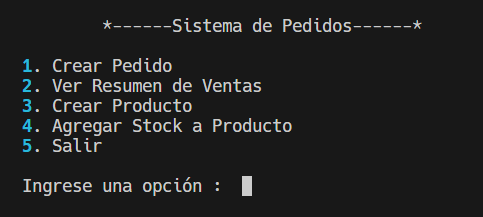

# Sistema de Pedido

Un sistema que permite solucionar los problemas que tiene la empresa, el objetivo alcanzado es poder ser lo mas eficiente posible, por lo cual la solucion se da en consola, esta es una de las soluciones (proximantente en web).  

## Problema:

Una empresa dedicada a la venta de productos al por menor necesita un sistema que permita registrar cada pedido realizado por sus clientes.

- La gerencia ha solicitado que el sistema pueda calcular el monto total a pagar por cada pedido.

- En caso de que un cliente adquiera una cantidad considerable de un mismo producto, se le aplique automáticamente un descuento especial.

- Además, al final de la jornada, el sistema debe generar un resumen con el total de ventas realizadas durante el día.

## Solucion:

### Analizamos el proceso:

1. Un cliente hace un pedido.
2. El recepcionista atiende el pedido.
3. Crea un pedido en el sistema.
4. Agregar los productos al pedido en el sistema.
5. Calcular descuento de los productos en el sistema.
6. Calcular el monto a pagar en el sistema.
7. Genera Boleta o Factura del pedido.
8. Entrega Boleta o Factura.
9. Al final del dia ve el resumen total de ventas realizadas durante el dia en el sistema.

## Requisitos:

- Python 3.12.4 o superior
- Librerias:
    - sqlalchemy
    - typer
- Base de datos:
    - sqlite

## Instalacion:

``` bash
git clone https://github.com/KenyiGM/sistema_pedido.git
cd sistema_pedido
pip install -r requeriments.txt
```

## Uso:

``` bash
python main.py
```

## Ejemplos:




